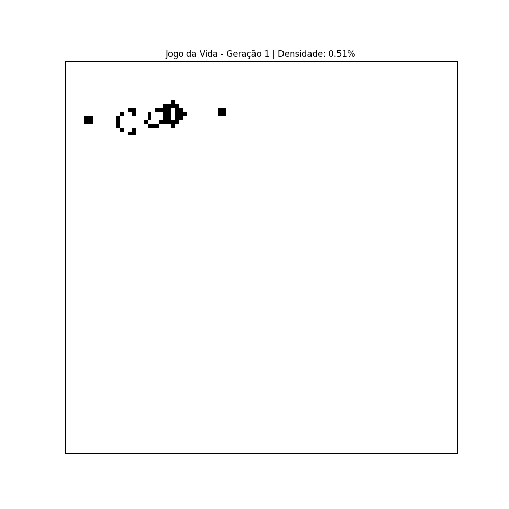
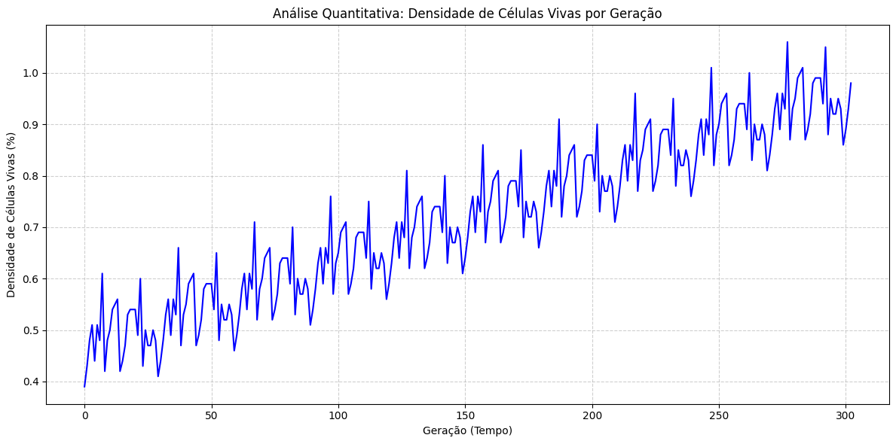

# Jogo da Vida de Conway - Simulação e Análise

Este é o meu projeto final para a cadeira de Autômatos Celulares.

É uma implementação em Python do clássico Jogo da Vida de Conway, mas com alguns recursos a mais que adicionei para permitir uma análise mais interessante do que acontece na simulação.

## O que ele faz

* **Animação da Simulação:** O script gera um arquivo `.gif` que mostra a evolução dos padrões na grade, geração por geração.
* **Gráfico de Densidade:** Além de só olhar a animação, achei que seria útil medir o que está acontecendo. Por isso, o programa também gera um gráfico (`.png`) que mostra a porcentagem de células vivas a cada geração. É uma forma legal de ver como a "população" total do sistema se comporta ao longo do tempo.
* **Padrões Clássicos:** No código, você pode escolher facilmente iniciar a simulação com alguns padrões famosos, como a **"Gosper Glider Gun"**, o **"Pulsar"**, ou simplesmente com um grid aleatório para ver o que acontece.

## Exemplo de Saída

Ao rodar o script com a "Gosper Glider Gun" como padrão inicial, estes são os arquivos que ele cria:

**1. A animação (`game_of_life_simulation.gif`)**


**2. O gráfico de análise (`density_analysis.png`)**


## Como Rodar o Projeto

É bem simples.

**1. Instalar as dependências:**

Primeiro, você precisa ter o `numpy`, `matplotlib` e `pillow` instalados. Se não tiver, pode instalar com pip:
```bash
pip install numpy matplotlib pillow